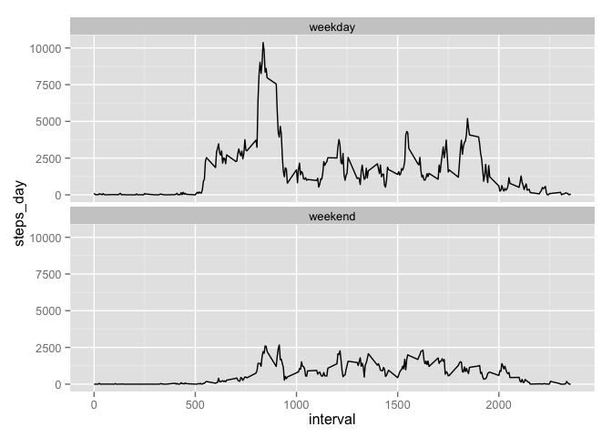

# Reproducible Research: Peer Assessment 1

##Introduction
This page is the result of a project for the course Reproducible Research. The project was based in the Activity Monitoring Database which can be downloaded [here](https://d396qusza40orc.cloudfront.net/repdata%2Fdata%2Factivity.zip "Title").

## Loading and preprocessing the data

Before loading the data the R environment was set to work in english language.

```r
Sys.setenv(LANG="EN")
Sys.setlocale("LC_TIME", "en_US")
```

```
## [1] "en_US"
```

```r
library(ggplot2)
```

The dataset was loaded:

```r
base<-read.csv("activity.csv")
```

And date collumn was set to date format.

```r
base$date<-as.Date(base$date)
```


## What is mean total number of steps taken per day?

The histogram below show the frequency of steps per day:

```r
library(plyr)
base_day<-ddply(base,~date,summarize,steps_day=sum(steps,na.rm=TRUE))
hist(base_day$steps_day)
```

 


The mean and the median of steps are presented below:

```r
mean(base_day$steps_day,na.rm=TRUE)
```

```
## [1] 9354
```

```r
median(base_day$steps_day,na.rm=TRUE)
```

```
## [1] 10395
```

## What is the average daily activity pattern?


The plot below show the average number of steps taken per 5-minute interval:

```r
base_interval<-ddply(base,~interval,summarize,steps_interval=mean(steps,na.rm=TRUE))
plot(base_interval$interval,base_interval$steps_interval, type="l")
```

 


The interval with the highest average number of steps is shown below:

```r
max<-max(base_interval$steps_interval)
max_interval<-base_interval[base_interval$steps_interval==max,]$interval
max_interval
```

```
## [1] 835
```

## Imputing missing values

The number of intervals with missing values is:

```r
is_na<-sum(is.na(base$steps))
is_na
```

```
## [1] 2304
```

The missing values were filled with the average of the interval. 

The histogram below show that distribution of the number of steps per day changed a little after filling missing data.

```r
base_filled<-merge(base,base_interval,x.interval=y.interval)
base_filled$steps<-ifelse(is.na(base_filled$steps)==TRUE, base_filled$steps_interval,base_filled$steps)
base_day_filled<-ddply(base_filled,~date,summarize,steps_day=sum(steps,na.rm=TRUE))
hist(base_day_filled$steps_day)
```

 

The mean and the median of steps in the filled dataset are presented below:

```r
mean(base_day_filled$steps_day,na.rm=TRUE)
```

```
## [1] 10766
```

```r
median(base_day_filled$steps_day,na.rm=TRUE)
```

```
## [1] 10766
```

## Are there differences in activity patterns between weekdays and weekends?

The difference between weekend and weedays can be seen in the chart below. It can be verified visually that weekdays have more steps and also have more variance than weekend.


```r
base_filled$weekday<-weekdays(as.Date(base_filled$date))
base_filled$week_part<-ifelse((weekdays(as.Date(base_filled$date))=="Saturday" | weekdays(as.Date(base_filled$date))=="Sunday"),"weekend","weekday")

base_filled$week_part<-as.factor(base_filled$week_part)

base_day_filled_week<-ddply(base_filled,~interval+week_part,summarize,steps_day=sum(steps,na.rm=TRUE))

ggplot(base_day_filled_week, aes(x=interval, y=steps_day))+
  geom_line()+
  facet_wrap(~week_part,nrow=2)
```

 

